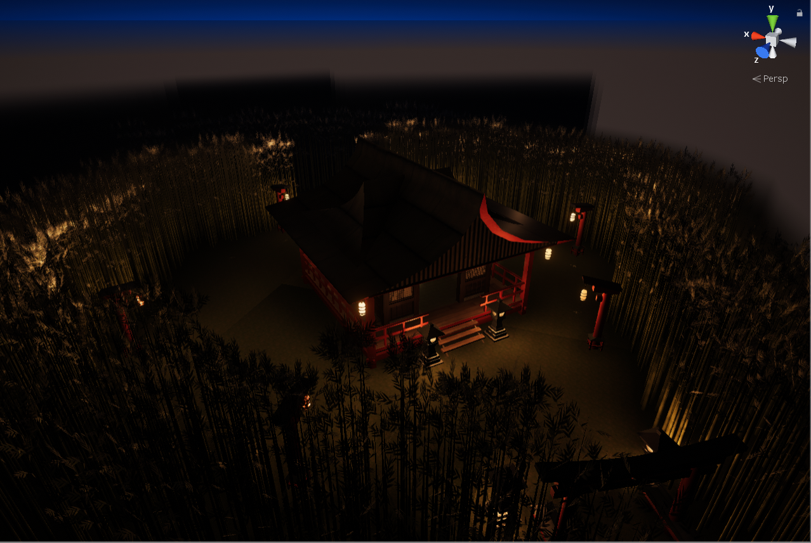
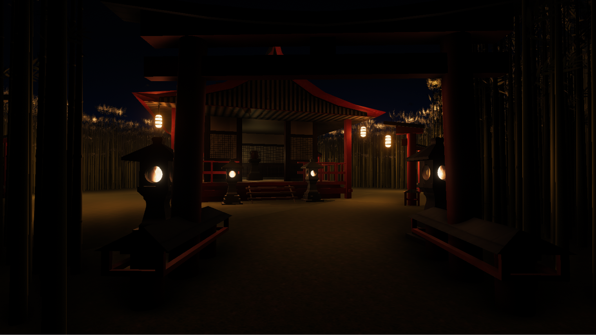
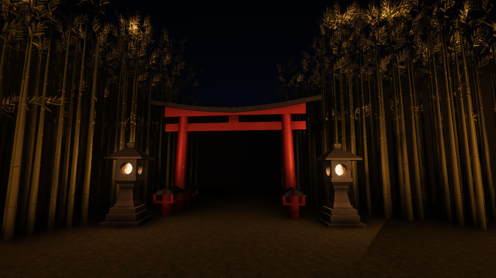
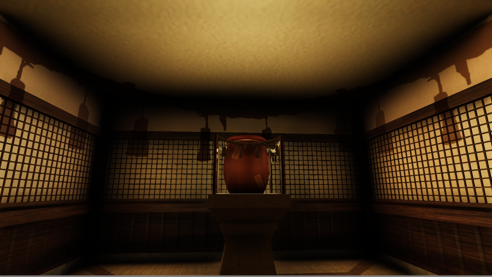

# 3D-Virtual-Environment-Shrine

## Summary
A Japanese style shrine in a bamboo forest (night)

## Models
All models were created and textured by me. Models were created and UV mapped in Autodesk Maya and the textures were created in photoshop.

## Effects
Particle systems and lighting was created in Unity. Due to the number of light sources in close proximity there is an issue with some of the shadows I am looking to fix. this could be done with baked lighting at the cost of the dynamic light flickering of the flames.

## Music
A music box rendition of "Reach for the Moon, Immortal Smoke" from Touhou 8 Imperishible Night was used for the music in the scene.

source : https://www.youtube.com/watch?v=OvzIIeMuBkI&ab_channel=Whitepool

## Screen Shots
  
  
  
